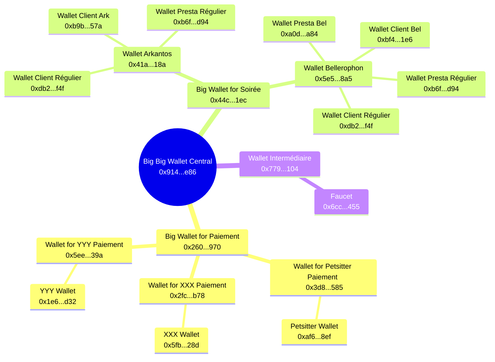

---
tags:
  - Osint
  - exif
  - LAF
  - Chall
  - casebandit
  - chainmap
  - crypto
order: 13
---

## Éléments déjà découverts
>Parce que ce CTF est très long, je me permets de partager, à la fin de chaque page dédiée, un extrait du graphique généré via [CaseBandit](https://app.casebandit.com), qui permet de visualiser l’ensemble des éléments et de garder une vue d’ensemble des liens entre personnes, lieux et indices.
>Voici le graphique issu de la dernière partie : [[Chapitre 2 - Acte 3 - Organisation]]

![[LAF_C2_A3_O.svg]]

Nous allons pouvoir nous appuyer dessus pour poursuivre nos recherches dans la suite du CTF.

---
## L'épine de l'Oursin

> [!challmaker] Eldwiin
### Énoncé
>Votre téléphone sonne, annonciateur d'une catastrophe, ou d'une bonne nouvelle : 
>![[LAF_C2_A3_F_EO_P.png]]
>
>Bon, vous ne savez pas trop quoi en penser. Au moins, vous avez obtenu une information importante, même si la méthode utilisé est un peu trop active à votre goût et pourrait même compromettre votre enquête.
>Mais bon, comme qui dirait, "A cheval donné on ne regarde pas les dents" !
>Voyons ce que vous pouvez tirer de cette adresse `0x3D8B1dAc8556a66c2A2280eaAA153C9b026e2585`.
>
>_Pour une question financière, les transactions ont eu lieu sur un testnet_
>
>>Pour valider le challenge, écrivez le message suivant _Merci Péhuson_ ? 

### RETEX

Ce challenge n’en est pas vraiment un. Il sert surtout à nous donner le contexte, à savoir : 
- Testnet. 
- L’adresse `0x3D8B1dAc8556a66c2A2280eaAA153C9b026e2585` a servi à payer le petsitter de Malo. 

On peut donc retrouver le wallet via le lien : [Sepolia Etherscan](https://sepolia.etherscan.io/address/0x3D8B1dAc8556a66c2A2280eaAA153C9b026e2585).

---
## La Pieuvre et ses Tentacules

> [!challmaker] Eldwiin, Zmondy
### Énoncé
>Cette adresse crypto est très intéressante. Dans une organisation de ce type, il est commun que la partie financière soit gérée par une personne dédiée à cela.
>
>>Quelle est l'identité de la personne gérant les finances de l'organisation ?
>
>_Format : `Jordan Belfort`

### RETEX

On peut déjà répondre à cette question grâce à la fiche RH.
![[LAF_C2_A3_C_IPV_O.png]]
Yves Poulain, alias « Leo », y est décrit comme faisant partie de la division Panthéra, en charge des finances et des relations. Mais il y est aussi noté comme étant « peu apte avec les nouvelles technologies mais excellent comptable ».

Étant donné qu’on parle ici de crypto, donc de nouvelles technologies, il faut un peu plus de preuves, puisqu’il est censé être peu à l’aise avec ces outils. 

En vérifiant les conversations sur Keybase, on peut trouver dans le canal « Membres-uniquement » une conversation où Virgata explique que Leo a leaké sur Facebook une adresse utilisée pour un paiement unique.
![[LAF_C2_A3_F_PT1.png]]
En cherchant donc Yves Poulain sur Facebook avec un filtre sur l’année 2026, on peut trouver [le compte facebook de Yves Poulain](https://www.facebook.com/profile.php?id=61587137346778).
![[LAF_C2_A3_F_PT2.png]]
Mais on trouve surtout un de ses posts qui explique qu’il s’est lancé dans la crypto pour son travail parce qu’on l’y a obligé. Il cite l’adresse `0x2fce52CB97292DEbFea77F8C8ED489a9c3545b78` et explique qu’il a réussi à compartimenter les usages avec une adresse par usage.

On en est donc maintenant certain : c’est **==Yves Poulain==** qui gère les finances de l’organisation, crypto comprise.

---
## Bonus - L'astuce du Singe

> [!challmaker] Eldwiin, Zmondy
### Énoncé
>Vous voilà donc avec une adresse crypto en plus de tout le reste sur les bras, comme si vous n'aviez pas assez de travail. Vous décidez donc de commencer à travailler sur celle-ci.
>
>>Quelle adresse crypto est utilisé pour gérer les paiements de la prochaine soirée organisée par le groupe ?  
>
>_Format : `0x71C7656EC7ab88b098deF751B7401B5f6d8976F`

### RETEX

On a pris un peu de temps pour résoudre ce challenge, et parce qu’on n’arrivait pas à bien visualiser les échanges de cryptos, Global a développé cet outil : [chainmap](https://github.com/gl0bal01/chainmap). Puis on a flag grâce à lui.

En gros, c’est un outil qui permet de lancer des investigations sur de la crypto via une clé d’API, et de créer un graphe pour visualiser tout ça.

Bon, commençons par le commencement : l’adresse crypto utilisée pour payer le petsitter : [0x3D8B1dAc8556a66c2A2280eaAA153C9b026e2585](https://sepolia.etherscan.io/address/0x3D8B1dAc8556a66c2A2280eaAA153C9b026e2585).
On peut voir via l'outil de Global ou un site comme [etherscan.io](https://sepolia.etherscan.io/address/0xaf6d527df0e0940aa0de5e82d9ff7b946ef338ef) que c’est un wallet qui a deux transactions entrantes, et une seule sortante.
![[LAF_C2_A3_F_AS1.png]]
La transaction sortante vers `0xaf6d527Df0e0940aA0DE5e82D9fF7B946Ef338Ef` signifie donc que `0xaf6d527Df0e0940aA0DE5e82D9fF7B946Ef338Ef` est le wallet utilisé par le petsitter pour encaisser l’argent de la meute rouge.
![[LAF_C2_A3_F_AS2.png]]
Les points rouges sur ce graphique, et sur ceux qui suivent, sont les points à partir desquels j’ai lancé des recherches avec une profondeur de deux nœuds.

On peut remarquer que, dans les deux transactions sortantes du wallet utilisé pour payer le petsitter, l’une des deux transactions est liée à un wallet avec énormément de transactions. Ce wallet n’en est pas vraiment un : c’est en réalité un EOA spam/fuzz, une adresse externe ultra-spammy utilisée pour du trafic de test ou du fuzz.

On va donc maintenant s'intéresser à la [deuxième transaction entrante](https://sepolia.etherscan.io/address/0x260d72d712835f9248d32082a0c25bb1a5cf0970).
![[LAF_C2_A3_F_AS3.png]]
En se rappelant les mots de Yves Poulain, on peut déjà déduire certaines choses de la forme créée par les transactions. Vu qu’il a compartimenté les usages par une adresse pour un usage, on peut imaginer que, de la même façon qu’il a une adresse pour payer le petsitter, il doit en avoir d’autres, chacune pour payer une personne différente. Au centre, il doit avoir un gros wallet qui gère cet argent central avant de l’envoyer vers des wallets à usage unique.

Ainsi, on en déduit qu’il y a encore deux autres wallets, en plus de celui destiné à payer le petsitter, qui sont utilisés et créés spécialement pour une occasion similaire. Il y a au centre un [gros wallet](https://sepolia.etherscan.io/address/0x260d72d712835f9248d32082a0c25bb1a5cf0970), et en autre transaction liée, [un wallet qui gèrent plusieurs transactions](https://sepolia.etherscan.io/address/0x9144f636e6f3f6f08e801b033c44ab953415be86) dont une boucle.
On va donc continuer du côté de ce dernier.

![[LAF_C2_A3_F_AS4.png]]
Globalement, à ce niveau-là, on n’a pas vraiment d’informations supplémentaires. On va donc orienter nos recherches vers le wallet [0x44c[...]1ec](https://sepolia.etherscan.io/address/0x44cab2ebe488450a35db34d4707ae761a5e0d1ec), puisqu’il a l’air de gérer encore plus de flux.
![[LAF_C2_A3_F_AS5.png]]
Cette fois-ci, le graphe s’est complexifié d’un coup. Mais en prenant notre temps, on découvre qu’[une de ces transactions](https://sepolia.etherscan.io/tx/0xf2cb20d3309c02e463f19218af109abfd3db4dc38aa8f8c4461d3b1f51e261e0) possède un input data qui nous permet d'y voir plus clair.
![[LAF_C2_A3_F_AS6.png]]
La transaction de `0xB9b[...]57a` vers `0x41A[...]18a` comporte la trace : `Inscription Arkantos`.
![[LAF_C2_A3_F_AS7.png]]
Et Arkantos, c’est un nom qui fait partie du fichier `soirées_nom_de_code.pdf` présent sur le drive Proton de la meute rouge, on n’est donc pas perdus : on a même éclairé un peu notre piste.
![[LAF_C2_A3_F_AS8.png]]

On peut aussi en trouver [une autre](https://sepolia.etherscan.io/tx/0x6f86f01b67d9be3ed527a6c16da582fad060ae9da1379cd53b2866ac6f80ad1f) de `0xBf4[...]1e6` vers `0x5E5[...]8a5` avec la trace : `Paiement pour Bellerophon`.
![[LAF_C2_A3_F_AS9.png]]
On arrive à distinguer un wallet qui a fait une transaction sortante vers le wallet Bellerophon, et une autre vers le wallet Arkantos ; on peut donc en déduire que c’est un client régulier.

Une autre transaction sort des deux wallets de soirée vers un wallet qui ne possède que ces transactions : c’est probablement un wallet lié à une dépense commune (presta, matos, etc.).

Enfin, [une dernière](https://sepolia.etherscan.io/tx/0xdc7d15e57103b861d77f4b228028983ac48d97a33036d306f8b7ca377fda4af3) de `0x5E5[...]8a5` vers `0xA0d[...]A84` possède la trace `Merci pour la prestation`, ce qui nous prouve que les transactions sortantes des wallets des soirées sont liées à des prestataires.
![[LAF_C2_A3_F_AS_F.png]]

Enfin, on peut s’apercevoir que le wallet `0x6cc[...]455` est en fait un faucet, au vu du nombre de transactions et de leur fréquence.
![[content/Notes/L'appel de la forêt/LAF_C2_A3_F/LAF_C2_A3_F_FC.png]]

![[LAF_C2_A3_F_AS_FF.png]]
En soi, on n’a pas besoin d’aller plus loin, on a déjà bien cartographié les flux de cryptos.

Étant donné que, sur Keybase et sur le site onion, les messagers indiquaient que la prochaine soirée utiliserait le nom de code Bellerophon, on a déjà trouvé l’adresse crypto utilisée pour gérer les paiements de cette soirée : **==0x5e53641f8f11280d998c7db6235358f4269818a5==**

---
## Synthèse de nos éléments
>Parce que ce CTF est très long, je me permets de partager, à la fin de chaque page dédiée, un extrait du graphique généré via [CaseBandit](https://app.casebandit.com), qui permet de visualiser l’ensemble des éléments et de garder une vue d’ensemble des liens entre personnes, lieux et indices.

![[LAF_C2_A3_F.svg]]