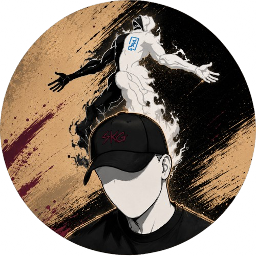
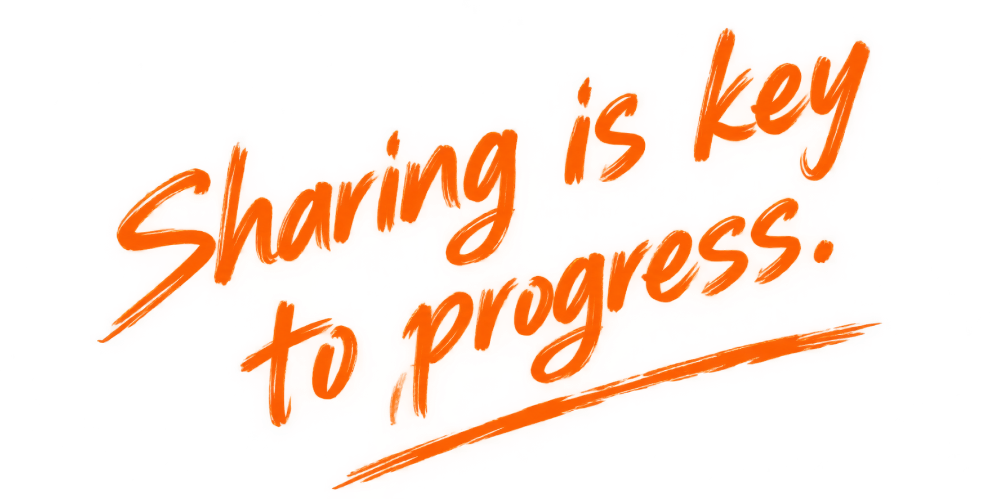
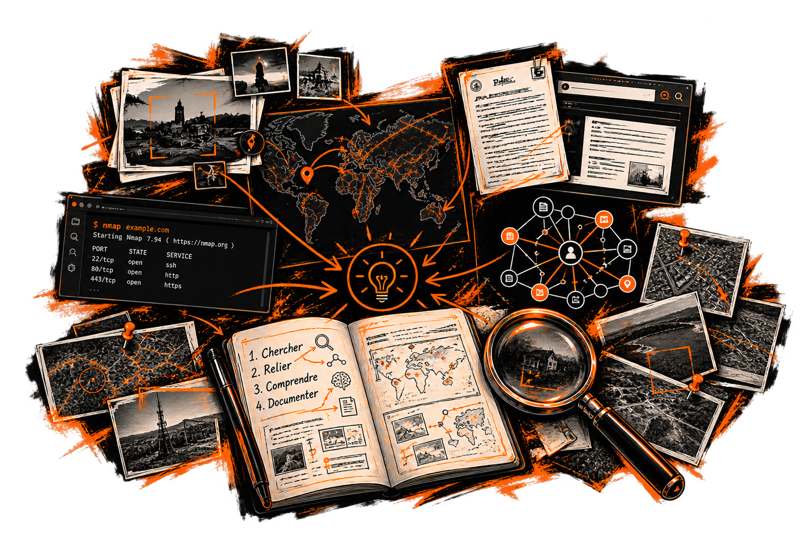

  
  

    <h2>SKG</h2>
    
Ingénieur cyberdéfense, passionné d'OSINT.

    

      🇫🇷 France
      Disponible immédiatement
    

  

<blockquote class="callout job" data-callout="job">

Recherche un poste OSINT

Disponible pour une opportunité en OSINT / investigation numérique.

</blockquote>

---
# ▸ Qui suis-je

Fraîchement diplômé ingénieur en cyberdéfense, je pratique l'OSINT par passion depuis un moment maintenant. Je me suis lancé dans la conception de ce site il y a maintenant 7 mois, dans le but de documenter ma méthodologie et ma progression à travers des RETEX de challenges classiques et de CTF complets.

Je m'attèle à les rendre chaque jour meilleurs, les plus compréhensibles possible, en synthétisant les informations récoltées dans de grands graphes qui se remplissent au fur et à mesure des RETEX. Ces RETEX couvrent de nombreux types de challenges, requérant des compétences en géolocalisation, recherche d'image inversée, croisement de sources ouvertes (ANFR, archives, cadastre), analyse de métadonnées, etc.

Je ne me contente pas de résoudre des challenges : j'en conçois aussi, notamment pour GCC et YouArePlayer. Concevoir mes propres épreuves m'oblige à réfléchir autrement aux méthodes d'investigation et aux fausses pistes. J'anime également un petit serveur Discord où je fais tester mes créations et centralise une partie de ma veille OSINT. Je partage aussi les outils que j'utilise sur ma page [Toolbox](/Toolbox/Toolbox) (encore peu mise à jour), et je suis bêta-testeur pour CaseBandit, un outil de prise de notes d'investigation, pour lequel je fais régulièrement des retours afin de l'améliorer.

Mes classements en CTF ne sont pas forcément excellents, et ce n'est pas ce qui compte le plus pour moi : mon objectif principal est de partager les connaissances que j'acquiers au fur et à mesure, pour qu'on apprenne tous ensemble. J'aime apprendre, et j'espère que mes lecteurs prennent autant de plaisir à découvrir de nouvelles méthodes en me lisant.

Le [Journal d'activité](/heatmap) donne un aperçu de ma pratique, de ma régularité et de ma progression.

---
# ▸ Ce que je recherche

Je recherche actuellement un poste où mettre à profit mes compétences en OSINT. 
Mon expérience professionnelle n'était pas centrée sur l'OSINT, mais c'est aujourd'hui le domaine vers lequel je souhaite orienter ma pratique.
Tout poste directement lié à l'investigation en sources ouvertes m'intéresse particulièrement.

🎯

Type de poste

Analyste OSINT

📍

Zone géographique

Environs de Poitiers,   mobile partout en France (ex. Rennes), hors Paris intra/extra-muros

📅

Disponibilité

Dès à présent (sous réserve d'un délai en cas de déménagement)

---
# ▸ Ce que je peux apporter

<svg xmlns="http://www.w3.org/2000/svg" viewBox="0 0 24 24" fill="none" stroke="currentColor" stroke-width="2" stroke-linecap="round" stroke-linejoin="round"><circle cx="11" cy="11" r="8"></circle><line x1="21" y1="21" x2="16.65" y2="16.65"></line></svg>

<h3>Méthodologie d'investigation</h3>

Face à des informations éparses, j'aime chercher les liens, confronter les sources et documenter le cheminement qui permet de passer d'une piste à une conclusion.

<svg xmlns="http://www.w3.org/2000/svg" viewBox="0 0 24 24" fill="none" stroke="currentColor" stroke-width="2" stroke-linecap="round" stroke-linejoin="round"><path d="M14.7 6.3a1 1 0 0 0 0 1.4l1.6 1.6a1 1 0 0 0 1.4 0l3.77-3.77a6 6 0 0 1-7.94 7.94l-6.91 6.91a2.12 2.12 0 0 1-3-3l6.91-6.91a6 6 0 0 1 7.94-7.94l-3.76 3.76z"></path></svg>

<h3>Outils & cadres</h3>

Je m'appuie notamment sur Maltego, SpiderFoot, Shodan et CaseBandit, ainsi que sur des cadres comme MITRE ATT&CK et DISARM pour structurer mes analyses.

<svg xmlns="http://www.w3.org/2000/svg" viewBox="0 0 24 24" fill="none" stroke="currentColor" stroke-width="2" stroke-linecap="round" stroke-linejoin="round"><path d="M16 21v-2a4 4 0 0 0-4-4H6a4 4 0 0 0-4 4v2"></path><circle cx="9" cy="7" r="4"></circle><path d="M22 21v-2a4 4 0 0 0-3-3.87"></path><path d="M16 3.13a4 4 0 0 1 0 7.75"></path></svg>

<h3>Leadership & pédagogie</h3>

J'ai naturellement pris le lead lors de mes premières investigations en équipe, un rôle que j'assume aujourd'hui pleinement : organisation, méthodologie commune et vulgarisation.

<svg xmlns="http://www.w3.org/2000/svg" viewBox="0 0 24 24" fill="none" stroke="currentColor" stroke-width="2" stroke-linecap="round" stroke-linejoin="round"><circle cx="18" cy="5" r="3"></circle><circle cx="6" cy="12" r="3"></circle><circle cx="18" cy="19" r="3"></circle><line x1="8.59" y1="13.51" x2="15.42" y2="17.49"></line><line x1="15.41" y1="6.51" x2="8.59" y2="10.49"></line></svg>

<h3>Esprit d'équipe</h3>

J'aime apprendre des autres autant que partager ce que je sais, en confrontant les approches pour faire progresser le collectif.

<svg xmlns="http://www.w3.org/2000/svg" viewBox="0 0 24 24" fill="none" stroke="currentColor" stroke-width="2" stroke-linecap="round" stroke-linejoin="round"><path d="M21 11.5a8.38 8.38 0 0 1-.9 3.8 8.5 8.5 0 0 1-7.6 4.7 8.38 8.38 0 0 1-3.8-.9L3 21l1.9-5.7a8.38 8.38 0 0 1-.9-3.8 8.5 8.5 0 0 1 4.7-7.6 8.38 8.38 0 0 1 3.8-.9h.5a8.48 8.48 0 0 1 8 8v.5z"></path></svg>

<h3>Langues</h3>

Anglais courant (TOEIC 930), italien élémentaire (B1), russe débutant (A1).

<svg xmlns="http://www.w3.org/2000/svg" viewBox="0 0 24 24" fill="none" stroke="currentColor" stroke-width="2" stroke-linecap="round" stroke-linejoin="round"><rect x="2" y="3" width="20" height="14" rx="2" ry="2"></rect><line x1="8" y1="21" x2="16" y2="21"></line><line x1="12" y1="17" x2="12" y2="21"></line></svg>

<h3>Curiosité & veille</h3>

J'aime tester de nouveaux outils et méthodes, et suivre l'évolution des pratiques en cyber et OSINT pour continuer à élargir ma façon d'investiguer.

---
# ▸ Mon expérience

💼

<h3>Alternant ingénieur cyberdéfense</h3>

Secteur assurance · 3 ans

2023 → 2026

Ces trois années m'ont permis de travailler sur des sujets variés de cyberdéfense et de développer une approche rigoureuse de la protection de l'information.

<ul class="experience-list">
<li>Mise en place d'un système de surveillance typosquatting (avec coordination juridique)</li>
<li>Surveillance des fuites de données affectant les salariés et alerte des concernés</li>
<li>Conception et pilotage de campagnes hameçonnage personnalisées</li>
<li>Automatisation de veille (Python, BeautifulSoup, Scrapy, Playwright, bots RSS)</li>
</ul>

Trois années qui ont renforcé une habitude que je conserve aujourd'hui : comprendre, documenter et partager.

---
# ▸ Me contacter

Une opportunité en OSINT ou envie d'échanger ?
N'hésitez pas à me contacter.

  <a class="about-cta" href="mailto:skgatwork@protonmail.com">Écrire un mail →</a>

CV disponible sur demande.

---

[[index|HomePage]] · | · [[heatmap|Journal d'activité]]
