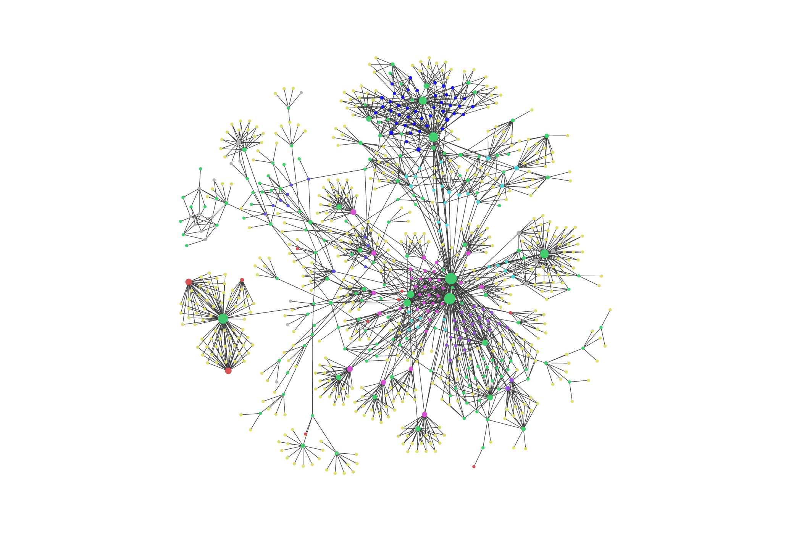

![[ban1.png]]
> Ici, je vais partager un peu mon expérience, que ça soit pour des challs simples, des CTF, ou même des outils que j'utilise.
> Le thème principal, ça sera l'OSINT, mais aussi potentiellement d'autres challenges qui m'intéressent.

---
# ▸ Mon activité en bref

  <a class="home-cta" href="./heatmap">Voir le journal d'activité →</a>

  
  
Capture de mon ancien vault Obsidian, que je ne touche plus.  Une partie de ces retex est déjà en ligne, le reste arrivera petit à petit.

---
# ▸ Coups de cœur

<article class="favorite-card"> 
	CTF 
	<h3 class="favorite-title">L'Appel de la Forêt</h3> 
	
Un marathon OSINT particulièrement long et immersif, porté par une histoire prenante jusqu'à un twist final marquant.

	 <a class="favorite-link" href="./Notes/L'appel-de-la-forêt/L'appel-de-la-forêt">Writeup →</a> 
 </article>

  <article class="favorite-card">
    CTF
    <h3 class="favorite-title">Medileak 3</h3>
    
Un CTF qui m'a particulièrement plu pour son format très immersif, sa progression par déblocage de challenges et la qualité de l'environnement mis en place.

    <a class="favorite-link" href="./Notes/Medileak-3/Medileak-3">Writeup →</a>
  </article>

  <article class="favorite-card">
    CTF
    <h3 class="favorite-title">Bleuet de France V5</h3>
    
Une vraie enquête historique : archives, cartes et témoignages, avec quelques rabbit holes particulièrement intéressants.

    <a class="favorite-link" href="./Notes/Bleuet-de-France-V5/Bleuet-de-France-V5">Writeup →</a>
  </article>

  <article class="favorite-card">
    CTF
    <h3 class="favorite-title">Bellatrix Orion 26</h3>
    
Organisé par le ComCyber. Réalisme et approche méthodologique, avec l'utilisation de DISARM sur une campagne de désinformation simulée.

    <a class="favorite-link" href="./Notes/Bellatrix-Orion-26/Bellatrix-Orion-26">Writeup →</a>
  </article>

  <article class="favorite-card">
    DFIR
    <h3 class="favorite-title">Masquerade</h3>
    
Un challenge DFIR sur TryHackMe, vraiment sympa même si la dernière partie (analyse d'un PE) était particulièrement fastidieuse.

    <a class="favorite-link" href="./Notes/TryHackMe/Masquerade">Writeup →</a>
  </article>

  <article class="favorite-card">
    SOC
    <h3 class="favorite-title">Phishing Unfolding</h3>
    
Une simulation de SOC très réussie sur TryHackMe, avec des alertes en temps réel. Dommage que la notation soit faite par une IA.

    <a class="favorite-link" href="./Notes/TryHackMe/Phishing-Unfolding">Writeup →</a>
  </article>

---
# ▸ Explorer par thématique

---

[[index|HomePage]]  · | ·  Les pages sympas  · | ·  [[heatmap|Journal d'activité]]
